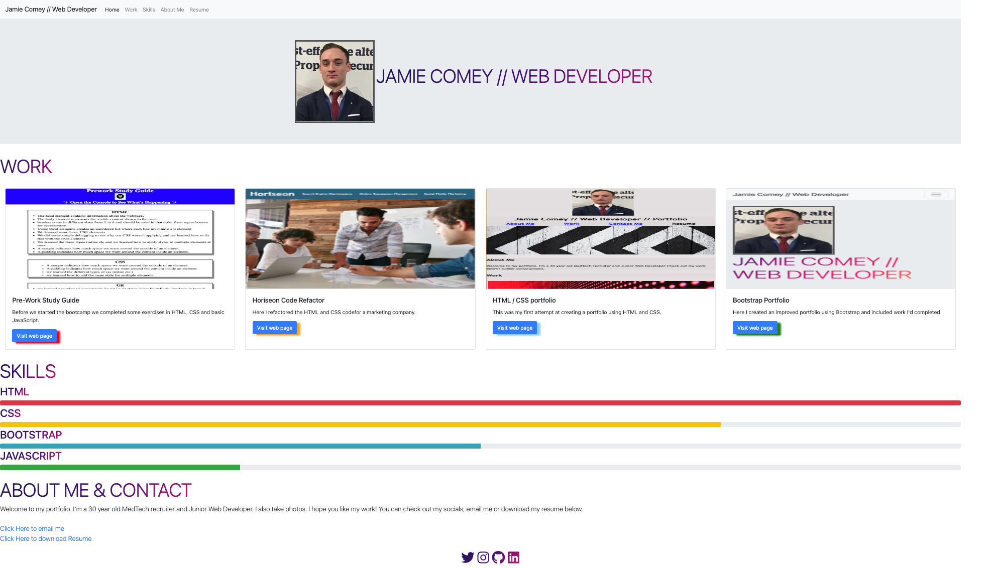
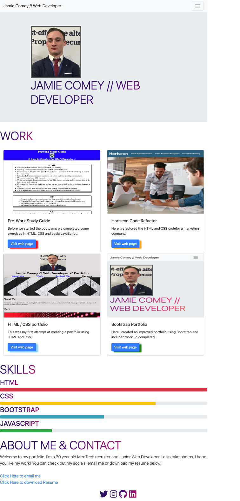
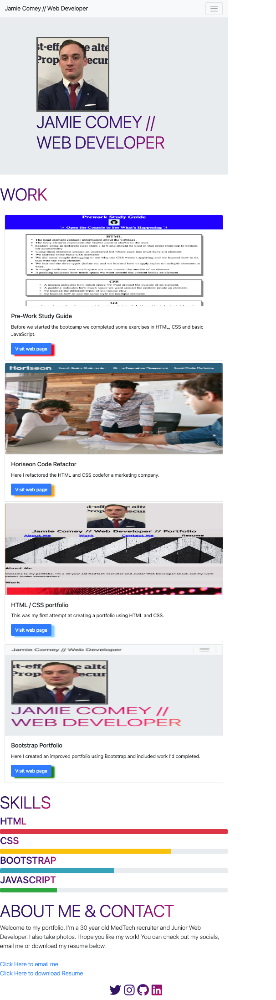

# Bootstrap-Portfolio

## Description

Here I converted the previous weeks challenge of creating a portfolio, into a similar one using bootstrap. 

It follows a slightly different layout as the challenge guide asks for a different order and new sections.

I also learned a lot during this week and have included that in this week's challenge including but not limited to:

- Hover effects
- Customising Bootstrap with an overriding CSS
- Using Icons to link to socials
- Having a hyperlink that would download my CV to user's PC when clicked.

## Screenshots

This is a screenshot of the full size webpage.

This is a screenshot of the page displayed at a medium size (tablets etc.)

This is a screenshot of the page displayed at a small size (phones etc.)

## Link to deployed application

- [Link to deployed website](https://jamiecomey.github.io/Bootstrap-Portfolio/)
- [Link to GitHub Repository](https://github.com/JamieComey/Bootstrap-Portfolio)

## Credits
 
Web Developer - Jamie Comey (@JamieComey)

## License
 
The MIT License (MIT)

Copyright (c) 2022 Jamie Comey

Permission is hereby granted, free of charge, to any person obtaining a copy of this software and associated documentation files (the "Software"), to deal in the Software without restriction, including without limitation the rights to use, copy, modify, merge, publish, distribute, sublicense, and/or sell copies of the Software, and to permit persons to whom the Software is furnished to do so, subject to the following conditions:

The above copyright notice and this permission notice shall be included in all copies or substantial portions of the Software.

THE SOFTWARE IS PROVIDED "AS IS", WITHOUT WARRANTY OF ANY KIND, EXPRESS OR IMPLIED, INCLUDING BUT NOT LIMITED TO THE WARRANTIES OF MERCHANTABILITY, FITNESS FOR A PARTICULAR PURPOSE AND NONINFRINGEMENT. IN NO EVENT SHALL THE AUTHORS OR COPYRIGHT HOLDERS BE LIABLE FOR ANY CLAIM, DAMAGES OR OTHER LIABILITY, WHETHER IN AN ACTION OF CONTRACT, TORT OR OTHERWISE, ARISING FROM, OUT OF OR IN CONNECTION WITH THE SOFTWARE OR THE USE OR OTHER DEALINGS IN THE SOFTWARE.